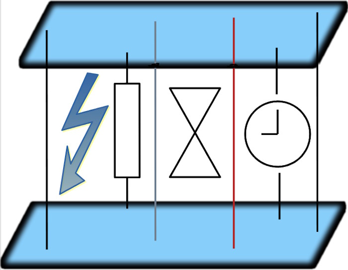

# Task as a model, Promise as a value

Many tailored and most well-known templates/paradigms, such as <samp><b>MVC</b></samp>, <samp><b>MVP</b></samp>, <samp><b>MVVM</b></samp>, <samp><b>MV<i>W</i></b></samp>[hatever], <samp><b>POCO</b></samp>, and custom solutions rest on [models](https://github.com/Kyriosity/read-write/blob/main/README%2B/software/design/parts/README+/app-model.md)<sup>⬅️</sup>. 
Developers bind presentations, actions, and messages to values/properties/callbacks. 

There's nothing wrong with this approach (especially for rough abstraction and logical division) but oversimplicity and static character. 

It treats models as snapped in a moment when every property is known and their status are final: as values can be predictably (pre)set/reset, or coded in a time slot, imperceptible for users or insignificant for hardware/software clients. 

<h3 align="center">However</h3>
<p>Domain <b>and</b> IT realities are not always under the best of circumstances with:</p>
<table><tr valign="top"><td width="40%"><picture></picture></td><td>
<ul>
<li>heavy or long calculations,</li>
<li>lagging network and services,</li>
<li>slow rudimentary storages,</li>
<li>pending answers and asynchronous events,</li>
</ul>
<p>and any operation can break, fail, run out of time, or be suspended/canceled/retried on both sides.</p>
<p>Enough scenarios shall mock delays to catch user attention or show proof of work. For example:
  <br>⏱️ Saving a giga-document, rebuilding a solution, or making a bank transaction can occur unnaturally instant, leaving users with a feeling it hasn't run.
  <br>⏱️ There's a minimum for a user to understand the pop-up message.
</p>
</td></tr></table>

> Modern languages and frameworks grant superb multitasking and synchro tools out-of-the-box. **, Even so,**  "classical" prevalent implementation incurs perpetual "async" patching of unpredictable values for reactive experience. 

Now, spice these reactive interfaces with `async`: you must break the queue of values and calls into orchestration. To make things worse recall that besides multitasking there's multi-dispatching (that's how auto-save, or spellcheck runs). Not to forget that the statuses of properties and operations are asynchronous values too.

<details><summary>___<ins><b>and now the&nbsp;&nbsp;<samp>T&thinsp;W&thinsp;I&thinsp;S&thinsp;T</samp></b>&nbsp;</ins> <b>.&thinsp;.&thinsp;.</b> ___</summary>
&nbsp;

Imagine that a user (view) input/action can be a _promise_. A bright example is a chess engine waiting most of its time for a player action. And the chess model (instance of a `game` class) is then ... the **view**.

We have our picture rotated 180° (or vertically flipped if you prefer). And it's not for fun but for viewing beyond the standard patterns.

\___________</details>

## Re-thinking model and presentation

**Let's cast async means to templates!**

<table><tr valign="top"><td><picture></picture></td><td>
<p>We are on the home stretch now, with a couple of items to close:</p>
  <lu>
    <li>Formliaze.</li>
    <li>Find application.</li>
    <li>Implement.</li>
    <li>Document.</li>
    <li><i>Repeat.</i></li>
  </lu>
<p align="center"><b><samp>voilà</samp></b></p>
</td></tr></table>

> 🚧🐝🚧 <mark><b>... to be WRITTEN when PARTICULAR IMPLEMENTATION comes into play ...</b></mark> 🚧🐝🚧

## Appendices. Techniques

Some established techniques and tricks can still contribute to async thinking or spoil its implementation (since any pattern may conditionally become an antipattern).

### Caching

The most obvious and simplest to add technique. Only growing cache may concern but its size can be dramatically reduced when big parts are "hashed" and stored only once (floating window method to help). Along with easy-to-apply <samp>FIFO</samp>.

### Laziness (not of developers)

Since the olden days, programmers have deferred the initialization/calculation of fewer or more "heavy" entities. This allows to **a)**&nbsp;load the stuff on&nbsp;demand only (eco-friendly), **b)**&nbsp;spread resources peaks, **c)**&nbsp;split suspense (which nevertheless remains).

<details><summary><ins>&nbsp;In <b>C#</b> you can do it either with <code>Lazy<...></code> or custom snippet like this:&nbsp;</ins></summary>
&nbsp;
  
  ```csharp
public BigAndHeavy Ram => _ram ?? LoadAndHit();
private BigAndHeavy? _ram;
  ```
\_______________
</details>

This technique looks attractive when <mark>$`(performance/hit)*probability`$</mark> is too low. Being advanced we may think of making an on-the-fly reevaluation of this formula to unleash the lazy, which implies a smart realization of the next technique - _preloading_.

#### Examples?

Consider custom number sequences (relying on previous values). The first must be easy to calculate unconditionally while attributing as lazy the next ones when it's getting harder to compute. When the computer is idle, next _lazy_ number gets calculated to have a reasonable supply (say of a hundred in sequence).

### Preloading: praise and critique

The power and storage even of home tablets are multiprocessor<sup>⚛️</sup>, multicore, excessive, and mostly idle<sup>:video_game:</sup>, while platforms like .NET, JVM, or browser engines, and any OS ensure the smooth background running of countless processes and threads.

The story has much reverted the _Lazy Loading_ - it's not crucial to delay tasks but to complete them as much as possible earlier and in the background, and then smoothly render results on demand.

It doesn't matter if you "pre-load" a dozen things, of which only one will be selected by the user (e.g. a next wizard page dependent on differing paths). Compare this to maintaining gross warehouses for a single well-founded purpose: to deliver goods within a day on customer orders.

&nbsp;&nbsp;&nbsp;&nbsp;<sup>⚛️</sup> <sub> There are at least three: main, math, and video.</sub>\
&nbsp;&nbsp;&nbsp;&nbsp;<sup>:video_game:</sup> <sub>Assumed: usual office, browsers, business applications, and dev environments (not high-performance servers, top games, video processing or mining).</sub>

**Eco-harmful?** Let's consider it when most blockchain mining farms are shut down.

### Streaming

Processing sync/async streams is a still fresh technique, which only requires a reference here to its [foundation](https://github.com/ReactiveX)<sup>:octocat:</sup>.

\___________\
🔚 🌔 <sub>2024-2025 .. kyriosity ... 🚧 pending 🚧</sub>
