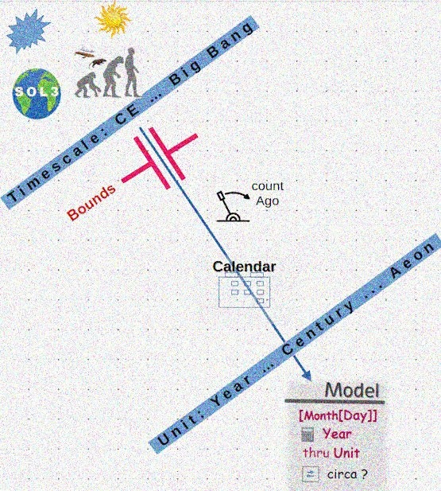

# Chronology - Timelines - Events

> **Time** is the _driver_ for all and the "solvent" of everything. The former is for software and the latter for its hardware.

Exact time measurement🔬 and timestamping aren't an issue for regular solutions but chronology.

Software of the previous millennium gave bits for dates (when bits means bits literally), thus nurturing the giant Y2K bug (and maybe [Y2038](https://en.wikipedia.org/wiki/Year_2038_problem))🔗.
Contemporary languages can support a vast range of past and future dates📆, but badly organize them (not intuitive and error-prone).

&nbsp;&nbsp;&nbsp;&nbsp;🔬 Unless you need accuracy close to [physics on steroids](https://www.nobelprize.org/prizes/physics/2023/summary/).🔗\
&nbsp;&nbsp;&nbsp;&nbsp;📆 C# `DateTime`, astonishingly giving way to Java, supports only Common Era. Though there are [`Calendar`](https://learn.microsoft.com/en-us/dotnet/api/system.globalization.calendar) classes to restraint rescue.

## Framework - Theses
       
### Initial requirements

+ Definition of timescales: eras, epochs, or calendars
+ Intuitive syntax rooting from Era/Epoch/Calendar specification
+ Approximation to specify events known as _circa_
+ Compile/run-time guards and constraints: range limit (e.g. 1-28/29/30/31 for months) compile- and run-time ()

  
<ins>🖼️&nbsp;<b>Overall Wizard diagram</b>&nbsp;</ins>

   <picture></picture>

📆 Calendar selection: when applicable and optional\
📱 Absolute year calculated from selection (epoch year, century, _etc_.)\
🔄 circa, optional mark to specify delta in the input unit

\________________________________

### Next - Features and demands 

+ Fuzzy comparison
+ Glossary 
+ Casting
+ More chronologies

+ **The coronation step** - re-making it as a solution of [Multifacet value](../U-Val)👑

&nbsp;&nbsp;&nbsp;&nbsp;&nbsp;&nbsp;&nbsp;&nbsp;👑 Where units of time present values as years are more than natural.

## Solutions

### C#.NET

|- [**AbcChrono**](../../../src/TuttiFrutti/AbcChrono/README.md)\
|--- [Source](../../../src/TuttiFrutti/AbcChrono/)\
|--- [Tests](../../../src/TuttiFrutti/ExtensionsTests/Chrono/)

🔚
