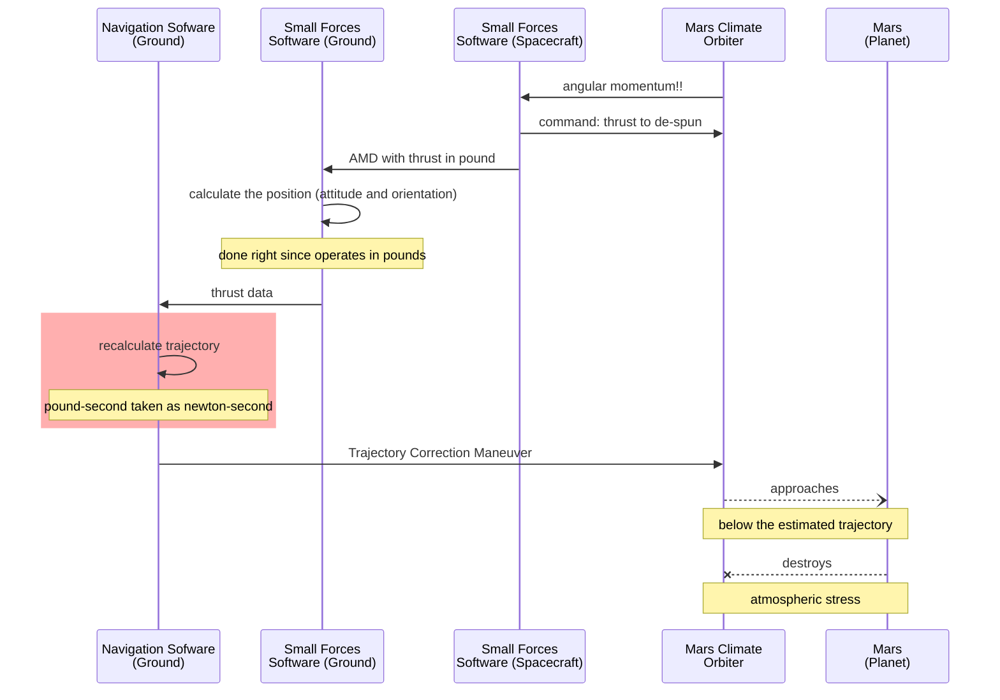

# Multifaceted Value 💠 (**Π-Val**) 

<p dir="rtl">?Gauges&nbsp;-<br />!<b>300</b>&nbsp;-<br />
?What 300&nbsp;-<br />?What gauges&nbsp;-</p>

 You may find the folklore right above dull but not pointless.&nbsp;&mdash; Math deals with <mark>abstract numbers</mark> (_numerus numerans_), computers operate on pure digits but not software developers and users.
 The "inputs" and "outputs" of software anchor to the material world, where numbers can be <mark>concrete</mark> (_numerus numeratus_) or <mark>denominated</mark> (_numerus denominatus_).
 
Verbal, documented, and, **programmatic** communications frequently rely on titles and contexts and omit denominations/units. Shall a context wane - values may "roam" between denominations:
<details><summary>&nbsp;<ins>&nbsp; Temperature <code>2.7</code> is&thinsp;</ins><b> .&nbsp;.&nbsp;.</b></summary>
... <ins>the baseline of outer space in <i>Kelvin</i></ins> but in earthly <i>Celsius</i> or <i>Fahrenheit</i> a normal winter forecast (placewhere on 40° or higher latitude) .
<br /><br />
            
- A close approach of Earth to Mars is ca. `33'900'000` _miles_ but seems credible in _kilometers_ and _nmi_.
- An unknown child's age of 7` can mean months and years.
- `Jack` can be family, given (not only on birth), and branded name.
- one apple may mean an electronic device too,
- The weekly payment of `1'000` dollars will get a national hue: Australian, Canadian, Jamaican, and twenty more. 

Concurrent measurement systems can make matters even worse, e.g. flight height can be communicated in <i>feet</i> while cockpit variometers may show <i>meters</i>.

\____________________________________________________________________________________________________ </details>

Not _denominated_ numbers in applications may imply a single system of categorization (e.g. SI for physical values) and ... open wide the gate to errors, including ill-famed techno-disasters.<sup>🔄️</sup>

Coding like `const OuterSpace_Baseline_Kelvin = 2.7` is univocal but inflexible and ugly to the object-oriented eye. As picky pros, we'd propose trailblazing syntax and features.

<div align="center"><b>Let's not beat around the bush but present what our project can deliver.</b> ⬇️</div>

### Mars Orbiter, or "The Empire [unit] Strikes Back"

<details><summary><ins>&nbsp;<i>Pound-force</i> [lbf] taken for <i>Newton</i> [N] destroyed the NASA Mars Climate Observer in 1999.&nbsp;</ins></summary>
&nbsp;
 
NASA expected metric data from the contractor but the latter reported thrust in the _US Customary units_, based on the good old British **Imperial Pound**. Thus the poor
[Mars Climate Orbiter](https://en.wikipedia.org/wiki/Mars_Climate_Orbiter)<sup><b>w</b></sup> was put below the "survival altitude" orbit. 


<div dir="rtl"><sub>Source: <a href="https://sma.nasa.gov/docs/default-source/safety-messages/safetymessage-2009-08-01-themarsclimateorbitermishap.pdf?sfvrsn=eaa1ef8_4">NASA: Lost in Translation, 2009</a></sub></div>

\____________________________________________________________________________________________________ </details>

Our framework could save astronomical bucks:

```diff

class Thrust : EventArgs
{
-   double Magnitude;
+   UVal.Phys.Mech.Force Magnitude;
    vector Direction;
    milliseconds Duration;
}

namespace CONTRACTOR.SmallForecesTeam;

event EventHandler<ThrustArgs> AngularMomentumDesaturation;

AngularMomentumDesaturation.Invoke(new Thrust {
-  Magnitude = reported_val,
+  Magnitude = Force.pound(reported_val),
   Direction = reported_dir, Duraion = duration
});

namespace NASA.Orbiter.NavigationTeam;

OnForce(Thrust thrust) {
-   Trajectory.Apply(thrust.Magnitude, thrust.Vector, thrust.Duration);
+   Trajectory.Apply(thrust.Magnitude.newton, thrust.Vector, thrust.Duration);
...
}

```

Conversion here is trivia, and <sub><picture></picture></sub> offers an implementation [you can test🧪](../../../src/TuttiFrutti/FuncStore.Convers.Tests/PhysMath/Mech/ForcesTests.cs).

HOW TO LINK TESTs TO DOCU

### Looks good ...

<b>... to stake out a repository for CV.</b>

❗The better syntax still won't be a solution: the contractor team of SmallForces knew that the thrust must be communicated in _newtons_. 
(They took the hardware reported value (the engineers there traditionally operated in the "house" system) and honestly submitted it as _N_. )

SECOND: Marsian seconds

Thus the first issue would be to allow limitation of the unit selection. 

```csharp

public enum In
{
    [Abbr("dyn")]
    dyne,

    [Abbr("N")]
    newton = 1_000_000_000_000,

    [Abbr("lbf")]
    pound_force = 4_448_222_000_000,

    [Abbr("kip")]
    kilopound = 1_000 * pound_force,

    [Abbr("pdl")]
    poundal = 138_254_954_376, // since 1877, Absolute English system
}
```
{}

And it's only one on the list of 

THE LINK TO FULL FILE!


You may notice that thrust isn't the only UNIT here (Marsian SECONDS!)

ToDo: SHOW THE CASES !

and show how we could make its software not only NEATER but also save about half a billion $$.


 total impulse produced by thruster firings produced results in pound-force seconds. The trajectory calculation software then used these results – expected to be in newton-seconds (incorrect by a factor of 4.45)

            🚧✏️🚧 ... **DRAFT** ... WORK in PROGRESS ... 🚧⌨️🚧
            ... REMOVE the LABEL when RELEASED ...


## Other cases

## Beyond

### Units are not only measurement systems

### Values are not only numbers

### Beyond a single crystal

Temp dep on pressure

- `$1'000` or `1'000€` have not only varying exchange divisions over the years, but differing purchase abilities for essential goods, 1GB of DRAM, or gold ounce&nbsp;**. . .**\


 ## Working TTL

 As a good developer, you will come to a better view, like `Heating.Max[Celcius] = 82.15` or `Landing.Speed.Knots` vs `.KmPerHour`. Then you will think about ways of initialization, conversion functions, math ops, constants, and other headaches. 

 And here you are, where such a framework is available for use, alteration, or just as a concept.

|- **Features and omissions**\
|--- Instantiation flexibility\
|--- Modularity behind interface\
|--- Generic-ism !\
|--- Constants: predetermined, instantiated vs. generated (as for Ce(Pa)\
|--- Arithmetic ops\
|--- Comparison\
|--- Cache

|- Handbook\
|- Description

|- **Used decisions**\
|-- General\
|--- Testing - gradula\
|-- Specific

|- BIG PIC REQUIRED

|- **Structure** and **Source code**\
|--- MeasData\
|--- Funcs\
|----- Intro\
|----- Tests\
|--- U-Val

|- **What's next**\
|--- ❄️ Project snowflake

## Features and omissions

## Overload of math ops

It looks first absolutely natural and a must.

``` var sum = Length.Meter(1) + Length.Centimeter(2)```

This [shabby meme](https://github.com/Kyriosity/read-write/blob/main/readme%2B/pencraft/readme%2B/_rsc/_img/memes/CalmDown_0Cplus0Cis64F.jpg) must remind the obstacle. 
 
You must already know the right conclusion: only for common-zero factored units.


