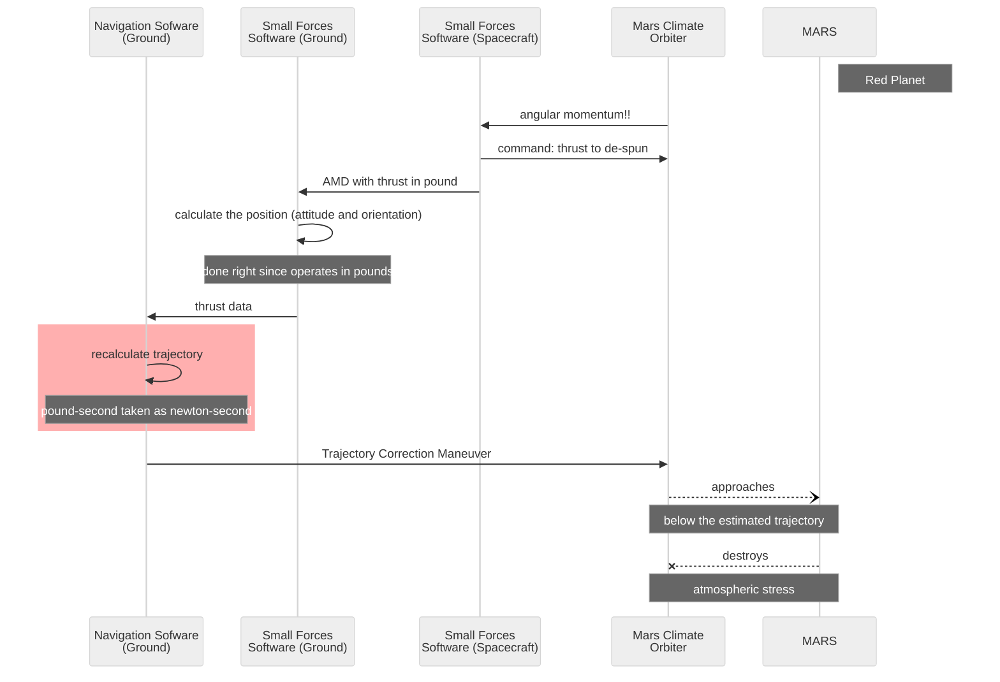

<h1 align="center">Multifaceted Value 💠 **Π-Val**</h1>

<p dir="rtl">?Gauges&nbsp;-<br />!<b>300</b>&nbsp;-<br />
?What 300&nbsp;-<br />?What gauges&nbsp;-</p>

 You may find the folklore right above dull, but not pointless.
 
> &nbsp;\
> **Math deals with <mark>abstract numbers</mark>** (_numerus numerans_), **and computers operate on pure digits, but not software developers and users.\
> \
 The "inputs" and "outputs" of software are anchored to the material world, where numbers can be <mark>concrete</mark>** (_numerus numeratus_) **or <mark>denominated</mark>** (_numerus denominatus_).\
> &nbsp;
 
Verbal, documented, and **programmatic** communications frequently rely on titles and contexts and omit tags/units. Shall a context wane - values may "roam" between denominators:

<details><summary>&nbsp;<ins>&nbsp; <b>Temperature <code>2.7</code> is</b>&thinsp;</ins><b> .&nbsp;.&nbsp;.</b></summary>
<ins>the baseline of the Universe space in <i>Kelvin</i></ins> but in  <i>Celsius</i> or <i>Fahrenheit</i> &nbsp;&mdash;&nbsp; a casual weather for many non-astronauts.<sup>🌡️</sup>
<br /><br />
            
- Earth's closest approach to Mars is ca. `33'900'000` _miles_ but it seems credible in _kilometers_ and _nmi_.
- A child's age of `7` can imply months and years.
- The weekly payment of `1'000` dollars has a national hue: Australian, Canadian, Jamaican, and twenty more.
- _`Jack`_ can be family, given (not only at birth), and a branded name.
- Five stars can mean a constellation and an estimation.

&nbsp; &nbsp;  &nbsp; &nbsp; <sup>🌡️</sup> <samp>`-40°` where **C** and **F** intercept is even more flawed &thinsp;&mdash;&thinsp; is a case required?</samp>

</details>

Concurrent measurement systems can make matters even worse, e.g., flight height can be communicated in <i>feet</i> while cockpit variometers will show <i>meters</i>.

Not _denominated_ numbers in applications may imply a single system of categorization (e.g. **SI** for physical values) and ... open wide the gate to errors, including ill-famed techno-disasters.

Coding like `const OuterSpace_Baseline_Kelvin = 2.7` is univocal but inflexible and ugly to the object-oriented eye. As picky pros, we will define trailblazing syntax and features.

### <a id="mars-orbiter" /><code>&lt;<samp>BAIT</samp><sub>🪝</sub>&gt;</code> Mars Orbiter, or "The Empire [unit] Strikes Back"

<details><summary><ins>&nbsp;<i>Pound-force</i> [lbf] taken for <i>Newton</i> [N] destroyed the NASA Mars Climate Observer in 1999.&nbsp;</ins></summary>
&nbsp;
 
NASA part of the software relied on metric data from the "contractor" (the report doesn't name the known company, and neither do I). Still, the latter sent thrust in the _US Customary units_, based on the good old British **Imperial Pound**. Thus the poor
[Mars Climate Orbiter](https://en.wikipedia.org/wiki/Mars_Climate_Orbiter)<sup><b>w</b></sup> was put below the "survival altitude" orbit. 


<div dir="rtl"><sub>Source: <a href="https://sma.nasa.gov/docs/default-source/safety-messages/safetymessage-2009-08-01-themarsclimateorbitermishap.pdf?sfvrsn=eaa1ef8_4">NASA: Lost in Translation, 2009</a></sub></div>

\____________________________________________________________________________________________________ </details>

<details><summary><ins>&nbsp;Our framework could save astronomical bucks:&nbsp;</ins></summary>

```diff

class Thrust : EventArgs
{
-   double Magnitude;
+   UVal.Phys.Mech.Force Magnitude;
    vector Direction;
    milliseconds Duration;
}

namespace CONTRACTOR.SmallForecesTeam;

event EventHandler<ThrustArgs> AngularMomentumDesaturation;

AngularMomentumDesaturation.Invoke(new Thrust {
-  Magnitude = reported_val,
+  Magnitude = Force.pound(reported_val),
   Direction = reported_dir, Duraion = duration
});

namespace NASA.Orbiter.NavigationTeam;

OnForce(Thrust thrust) {
-   Trajectory.Apply(thrust.Magnitude, thrust.Vector, thrust.Duration);
+   Trajectory.Apply(thrust.Magnitude.newton, thrust.Vector, thrust.Duration);
...
}

```

Conversion here is trivial, and <sub><picture></picture></sub> offers an implementation [you can test🧪](../../../src/TuttiFrutti/FuncStore.Convers.Tests/PhysMath/Mech/ForcesTests.cs).

\____________________________________________________________________________________________________ </details>

### Looks good ... `</🪝>`

<b>... to stake out a repository for CV.</b> But it's not a solution

❗The contractor team of SmallForces knew that the thrust must be communicated in _newtons_. 
They took the hardware reported value (the engineers there traditionally operated in the "house" system) and honestly submitted it as _N_. 

Thus, the first issue would be providing the unit selection's limitations. 

```csharp

public enum In
{
    [Abbr("dyn")]
    dyne,

    [Abbr("N")]
    newton = 1_000_000_000_000,

    [Abbr("lbf")]
    pound_force = 4_448_222_000_000,

    [Abbr("kip")]
    kilopound = 1_000 * pound_force,

    [Abbr("pdl")]
    poundal = 138_254_954_376, // since 1877, Absolute English system
} 
```

And it's only one on the list of ...

## Other cases

## Beyond

### Units are not only measurement systems

### Values are not only numbers

### Beyond a single crystal

Example: Temperature dependency on pressure

```csharp
Pressure(val, In).Temperature(val, In)
```


|- **Features and omissions**\
|--- Instantiation flexibility\
|--- Modularity behind interface\
|--- Generic-ism !\
|--- Constants: predetermined, instantiated vs. generated (as for Ce(Pa)\
|--- Arithmetic ops\
|--- Comparison\
|--- Cache

|- Handbook\
|- Description

|- **Used decisions**\
|-- General\
|--- Testing - gradula\
|-- Specific

|- BIG PIC REQUIRED

|- **Structure** and **Source code**\
|--- MeasData\
|--- Funcs\
|----- Intro\
|----- Tests\
|--- U-Val

|- **What's next**\
|--- ❄️ Project snowflake

## Features and omissions

## Overload of math ops

It applies to common-zero factored units, for example:

``` var sum = Length.Meter(1) + Length.Centimeter(2)```
 
__________\
🔚 ..2024-2025 ... 🚧🚧🚧 WORK in PROGRESS 🚧🚧🚧 ...
