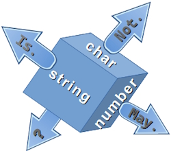
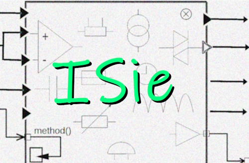

<h1 align="center">⭐&thinsp;I&thinsp;S&thinsp;i&thinsp;e&thinsp;⭐ &nbsp; &mdash; &nbsp; <code>Is.</code>➕ <samp>extensions</samp></h1>

<table align="center"><tr valign="top"><td><picture></picture></td><td>

<b>The crossover of these two <code>C#</code> discoveries</b>

&nbsp; &nbsp; ✔️ &thinsp;legit <a href="../../../frames/README+/calls_on_null.md">calls on null</a>&thinsp;,

&nbsp; &nbsp; ✔️ &thinsp;<a href="https://github.com/dotnet/roslyn/issues/11159">proposal</a>&thinsp;⏳ of extension properties

suggested me to shortcut ubiquitous 

  
<code>string.IsNullOrWhiteSpace(<i>abracadabra</i>)</code> into <code><i><b>abracadabra</b></i>.IsNullOrWhitespace</code>, 
  which finally became <code><i><b>abracadabra</b></i>.Is.NullEmptyOr.Whitespace</code>&thinsp;.

</td><td><picture></picture> 
  
<samp>uses circuitry</samp>
</td></tr></table>

⏳&thinsp;This ever-pending feature must be C#13 "what's new", but finally appeared only as a C#14 preview (April/2025).

### This isn't an idea to announce unless together with:

+ Reconsideration of all available `Is`, `To`, `Equal`, ... methods of built-in types.
+ **Better syntax**: shorter, intuitive, and grouped,
+ **New functionality** beyond shortcuts (theoretically to port them to other languages),
+ **.&thinsp;.&thinsp;.** but ...

<h3 align="center">... let's not beat around the bush and show what's the box:</h3>

<table align="center"><tr></tr><tr><td>🧪<b>By guidance</b> (recommended)</td><td>⚡<b>Direct</b> (when you need)</td></tr>
  <tr valign="top"><td>
  
Here is the entry point:

  <h2 align="center"><a href="../../../../src/TuttiFrutti/ISie_Eval/BuiltinTypes">D<samp>&thinsp;E&thinsp;M&thinsp;O&thinsp;S</samp>&nbsp;&nbsp;&nbsp;<samp>a&thinsp;n&thinsp;d</samp>&nbsp;&nbsp;&nbsp;T<samp>&thinsp;E&thinsp;S&thinsp;T&thinsp;S</samp></a></h2>
  
Optimized for navigation.

  </td><td>
    
  If you're eager to start without guidance, just add
    
   [<ode>using ISie</code>](../../../../src/TuttiFrutti/ISie),
  
  and let IntelliSense help you!

  </td></tr><tr><td colspan="2" align="center">It's better to explore in Visual Studio 2022 or another compatible IDE.</td></tr></table>

## Why `.Not.`?

If it's just <code>❗subj.Is...</code>. The answer is "**discern**" &thinsp;&mdash;&thinsp; surrounding symbols may shade subtle `!`. 
(**C#** itself offers `is not`.)

It's up to you which lexis to pick in **each** case.

<table><tr><td align="center"><b>algebraic language</b></td><td align="center"><b>perceptible tongue</b></td></tr><tr><td>

<code>if(<mark><b>!</b></mark>longStringVarName.Is.NullOr.Empty())</code>

<code>x => <mark><b>!</b></mark>x.Is.EmptyOr.Whitespace()</code></td>

<td>

<code>if(longStringVarName.<b>Not</b>.NullOr.Empty())</code>

<code>x => x.<b>Not</b>.EmptyOr.Whitespace()</code>

</td></tr></table>

## Not only `Is/Not`

It wasn't a big deal to add some other evident shortcuts: 

+ for ✨[`.To` for chars](../../../../src/TuttiFrutti/ISie_Eval/BuiltinTypes/🔣Char/✨Demo_To.cs)
+ for ✨[numeric operations](../../../../src/TuttiFrutti/ISie_Eval/BuiltinTypes/🔢Number/✨Demo🔢Calc🧮.cs) as `Abs`

## What's next

**IS<samp>IE</samp>** is a subject of expansion (Unicode alone is a [big candidate](https://www.unicode.org/glossary/)🔗) and a platform for kin features:

+ `.Equal` for strings needs better syntax than the onerous comparison options. 
+ detecting tongues used in text (`Has<Greek>`),
+ micecllaneoud `All.`, `Can.`, `None...`,
+ _many more_ but which will find its users.

## Spin-Offs

⭐<b>I&thinsp;S&thinsp;<samp>I&thinsp;E</samp></b>⭐ is a remarkable centerfold for miscellaneous concepts and other parts/features.

[TDD watershed](https://github.com/Kyriosity/read-write/blob/main/README+/software/tests/asDrive/README+/TDD-Watershed/README.md#TDD-ISie) refers ⭐ISie⭐ for explanation.

This feature launched 

+ 🗣️&thinsp;tongues categorization in [Abc Lingua](../../../../src/TuttiFrutti/AbcLingua),
+ 🪫&thinsp;[Circuitry](../../../techniques/README+/circuitry) (as a pattern via techniques),
+ 🏗️&thinsp;[Code wizards](../../../../src/TuttiFrutti/WizConstr/README.md),
+ 🧪&thinsp;[Assert shortcuted to assign](../../../../src/TuttiFrutti/FeatTest/AssertByAssign)

\___________\
🔚 .. <samp>🐝🐝 <code>OR</code> ❗too 🐝</samp> ... 🌘 **2025** ... 
