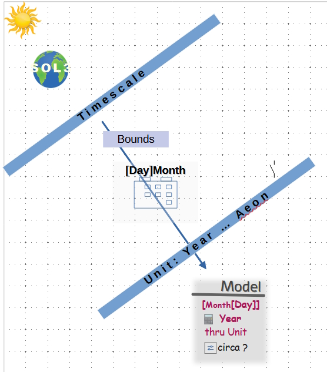

# Chronology - Timelines - Events

Time is the _driver_ for all and the "solvent" of everything. The former is for software and the latter for its hardware.

Exact time measurement🔬 and timestamping aren't an issue for regular solutions but chronology.

Software of the previous millennium gave bits for dates (when bits means literally bits), thus nurturing the giant Y2K bug. 
Contemporary languages can support a vast range of past and future dates📆, but badly organize them (not intuitive, error-prone).

&nbsp;&nbsp;&nbsp;&nbsp;🔬 Unless you need accuracy close to [physics on steroids](https://www.nobelprize.org/prizes/physics/2023/summary/).🔗\
&nbsp;&nbsp;&nbsp;&nbsp;📆 Astonishly surrending to Java  C# `DateTime`supports only Common Era. Though there are [Calendar](https://learn.microsoft.com/en-us/dotnet/api/system.globalization.calendar)🔗 classes to limited rescue.

## Framework - Theses
       
### Initial requirements

+ Definition of timescales: eras, epochs, or calendars
+ Intuitive syntax rooting from Era/Epoch/Calendar specification
+ Approximation to specify events known as _circa_
+ Compile/run-time guards and constraints: range limit (e.g. 1-28/29/30/31 for months) compile- and run-time ()

  
<ins>&nbsp;<b>Overall Wizard diagram</b>&nbsp;</ins>

    <picture></picture>

📆 Calendar selection: when applicable and optional\
📱 Absolute year calculated from selection (epoch year, century etc.)\
🔄 circa: optional mark to specify delta in the input unit

---

### Next - Features and demands 

+ Fuzzy comparison
+ Glossary 
+ Casting
+ More chronologies

### The crown - Integration with U-Val

## Solutions

INTRO PENDING!

|- [C# AbcChrono](../../../src/TuttiFrutti/AbcChrono)\
|--- Source\
|--- Tests

