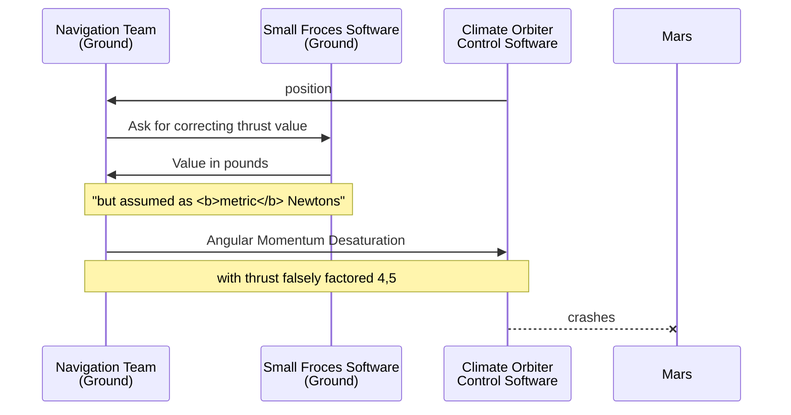

            🚧✏️🚧 ... **DRAFT** ... WORK in PROGRESS ... 🚧⌨️🚧
            ... REMOVE the LABEL when RELEASED ...
            
# Multifaceted Value :diamond_shape_with_a_dot_inside: (**U-Val**)

<p dir="rtl">?Gauges&nbsp;-<br />!<b>300</b>&nbsp;-<br />
?What 300&nbsp;-<br />?What gauges&nbsp;-</p>

 You may find the folklore right above dull but not pointless.&nbsp;&mdash; Math deals with <mark>abstract numbers</mark> (_numerus numerans_), computers operate on pure digits but not software developers and users.
 The "inputs" and "outputs" of software anchor to the material world, where numbers can be <mark>concrete</mark> (_numerus numeratus_) or <mark>denominated</mark> (_numerus denominatus_).
 
Verbal, documented, and, **programmatic** communication more than often relies on title and context and omits denominations/units. However should this context blur - values may roam between denominations:

<details><summary>&nbsp;<ins>&nbsp; Temperature <code>2.7</code> is&thinsp;</ins><b> .&nbsp;.&nbsp;.</b></summary>
... the baseline of outer space in <i>Kelvin</i> but in earthly <i>Celsius</i> or <i>Fahrenheit</i> a normal winter forecast (placewhere on 40° or higher latitude) .
<br /><br />
            
- A close approach of Earth to Mars is ca. `33'900'000` _miles_ but seems credible in _kilometers_ and _nmi_.
- A child's age of `7` can mean months and years.
- `Jack` can be family, given (not only on birth), and branded name.

+ one apple,
+ Your weekly payment will be `1'000` dollars [WHICH] use OF $$$

\___________ </details>

Concurrent measurement systems can make matters even worse, e.g. echelons on EU domestic flights are set in <i>feet</i> while cockpit variometers may show <i>meters</i>.

Not _denominated_ numbers in applications may imply a single system of categorization (e.g. SI for physical values) and ... open wide the gate to errors, including ill-famed techno-disasters.

 Univocal coding like `const Temperature_AbsZero_Kelvin = 0.00` is old-fashioned and ugly to the object-oriented eye. As a picky pro, you'd PREFER IT TO THE SYNTAX that our U-VAL-EMBLEM renders.

Let's not beat around the bush but present what our project can deliver.

## Mars Orbiter, or "The Empire [unit] Strikes Back"



Let's present our FEAT take an epic story of the poor [Mars Climate Orbiter](https://en.wikipedia.org/wiki/Mars_Climate_Orbiter)<sup><b>w</b></sup>, 1999.

https://sma.nasa.gov/docs/default-source/safety-messages/safetymessage-2009-08-01-themarsclimateorbitermishap.pdf?sfvrsn=eaa1ef8_4

 https://llis.nasa.gov/llis_lib/pdf/1009464main1_0641-mr.pdf
 
````diff
namespace NASA.Missions.Mars

class ClimateOrbiter
{
    void Correct(int orbit) {
        var thrust = JetPropulsionLab.Calc.Get(); // RESULT -> POUNDS
      var orbiterThrust // RECALL SWAP OP with tuple
       MartinLockheed.Orbiter.Thrust = thrust;
       Thread.Sleep(1000);
    //  the ground Small Forces software calculated the trajectory in pounds force, increasing figures by a factor of 4.45
// Ground navigation Software used METRIC
}
}
```

You may notice that thrust isn't the only UNIT here (Marsian SECONDS!)

and show how we could make its software not only NEATER but also save about half a billion $$.


 total impulse produced by thruster firings produced results in pound-force seconds. The trajectory calculation software then used these results – expected to be in newton-seconds (incorrect by a factor of 4.45)


## Beyond

### Beyond units

### Beyond numbers

### Beyond single crystal

Temp dep on pressure

- `$1'000` or `1'000€` have not only varying exchange divisions over the years, but differing purchase abilities for essential goods, 1GB of DRAM, or gold ounce&nbsp;**. . .**\


 ## Working TTL


 As a good developer, you will come to a better view, like `Heating.Max[Celcius] = 82.15` or `Landing.Speed.Knots` vs `.KmPerHour`. Then you will think about ways of initialization, conversion functions, math ops, constants, and other headaches. 

 And here you are, where such a framework is available for use, alteration, or just as a concept.

|- **Features and omissions**\
|--- Instantiation flexibility\
|--- Modularity behind interface\
|--- Generic-ism !\
|--- Constants: predetermined, instantiated vs. generated (as for Ce(Pa)\
|--- Arithmetic ops\
|--- Comparison\
|--- Cache

|- Handbook\
|- Description

|- **Used decisions**\
|-- General\
|--- Testing - gradula\
|-- Specific

|- BIG PIC REQUIRED

|- **Structure** and **Source code**\
|--- MeasData\
|--- Funcs\
|----- Intro\
|----- Tests\
|--- U-Val

|- **What's next**\
|--- ❄️ Project snowflake

## Features and omissions

## Overload of math ops

It looks first absolutely natural and a must.

``` var sum = Length.Meter(1) + Length.Centimeter(2)```

This [shabby meme](https://github.com/Kyriosity/read-write/blob/main/readme%2B/pencraft/readme%2B/_rsc/_img/memes/CalmDown_0Cplus0Cis64F.jpg) must remind the obstacle. 
 
You must already know the right conclusion: only for common-zero factored units.


