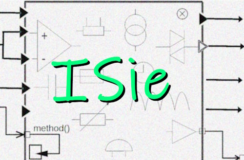

# P<samp>atterns via techniques</samp> &mdash; Circuitry

That's the description where _inductive reasoning_ is to rescue (namely by an example).

\__________________________________________________________________________________________________________________

Consider a bundle of interlaced "either"-functions (PSEUDO-CODE WARNING)

```csharp
class Is {
  string _inner;

  bool NullOrEmpty => _inner is null || ' == _inner;
  bool NullOrWhitespace { ... };
  bool Ascii { ... };
  bool Latin { ... };
  bool AlphaNumeric { ... };
}

```

and there's a client that needs these functions exactly as `neither`.

Since there's no magic and out-of-the-box _Boolean Inverter_ wand🪄 the fastest way will be to put the wrapper over

```csharp
class Not : Is {
  override NullOrEmpty => !NullOrEmpty;
  override NullOrWhitespace => NullOrWhitespace;
  override Ascii => !Ascii;
  override Latin => !Latin;
  override AlphaNumeric => !AlphaNumeric;
}
```

HAVE YOU NOTICE A TYPO i INTENTIONALLY LEAVED ? I personally don't like such wrappers.

\__________________________________________________________________________________________________________________


CONSTRUCTOR (VIOLATES)
   PROPS => EXPOSED

It was CIRCUITRY BUT WHY WAND?


is an EXPERIMENTAL technique

// Illustration pending

It's the case going. Consider a class that 

why not 
constructors, init props, or derived classes?

## Circuitry thru markup

## <a id="why-circuitry" /> Wrap up. Why "circuitry"?

<table><tr valign="top"><td width="40%"></td><td>
  <p>You may have already guessed the name.</p>
  <p>Didifal is only for `boolean`.</p>
</td></tr>
</table>

🔚
