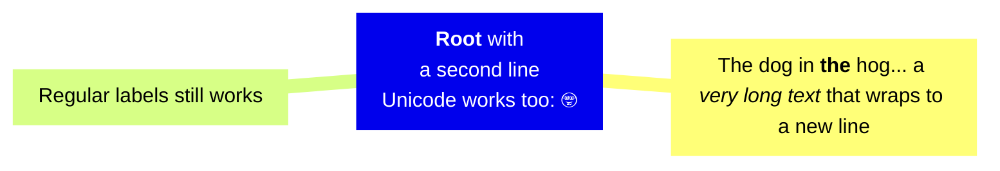

# P<samp>atterns via Techniques:</samp> Object-oriented Circuitry

	<p>aaa&#8719;bbb</p>&#8719;

> __«C<samp>IRCUITRY</samp>» as an idea is better presented by _inductive reasoning_ &mdash; from a case below.__

Consider a bundle of interlaced "_either_"-functions:

<div align="right"><sub><i>C#-like pseudo-code for brevity</i></sub></div>

```csharp
class Is {
  string _text;

  bool NullOrEmpty => _text is null || '' == _text;
  bool NullOrWhitespace { ... };
  bool Ascii { ... };
  bool Latin { ... };
  bool AlphaNumeric { ... };
}

```

and there's a demand for them (functions) as **`neither`**. Since there's no magic out-of-the-hat 🪄 _Boolean Inverter_ the most predictable way will be a wrapper over:

```csharp
class Not : Is {
  override NullOrEmpty => !NullOrEmpty;
  override NullOrWhitespace => !NullOrWhitespace;
  override Ascii => !Ascii;
  override Latin => !Latin;
  override AlphaNumeric => !AlphaNumeric;
}
```

It's not a single realization option **but what if** instead of a "programmatic" approach, we offer a kind of <samp><mark>declarative markup</mark></samp>.

```csharp

class Is<Fn> : Is where Fn : Function<bool, bool> {
   override NullOrEmpty => Fn(NullOrEmpty);
   ...
}

class Not : Is<Invert>;
class Denier : Is<False>;
class Stub : Is<True>;
class Identity : Is<Wire>; 

```

This simplest _unary boolean_ has four parametrization variants &mdash; other types are much more combinatory and appealing.

## Some ideas 



### Bring your own function:

`"some string".Equals<Loose>(CompareOptions.IgnoreCase);`

Random<ALGORITHM>.Within(1, 100)

### Lingua

text.Is<French, Latin>.Alphanumeric;

### Custom objects

### Dynamic "Majic Wand"

This must be the most controversial proposition.

```csharp
custom_object.Apply<Fn>.For<IMethods>();
```

<details><summary><a id="why-circuitry" /><ins>&nbsp;&nbsp;&nbsp;<b>Lyric Digression: Why "Circuitry"&thinsp;?</b>&nbsp;&nbsp;&nbsp;</ins></summary>

<table><tr valign="top"><td width="40%"></td><td>
  <p>You may have already grasped the similarities of the proposed solution to electric and electronic circuits and boards.</p>
  <ul>
  <li><code>Booleans</code> match logic gates .</li>
  <li><code>Numbers</code> &mdash; digital circuits.</li>
   <li><code>string</code> and classes are analogue electronics.</li>
  </ul>
  <p>Generic "markup" is like plugging elements on IO or onto circuits of a functional plate: direct, chaining, cascading, ...</p>
  <p>And the running code is the current. We are back to the roots (of machine language).</p>
</td></tr>
</table>

\___________</details>

## Implementation examples


## Pros and cons

✅ First of all, the split of design in a good way - as a side abstraction.

+ Markup is friendlier for comprehension.

declarative is plus

🛑 Overengineering

🗝️🕰️ implementation obstacles 

**`C#`** doesn't have `Func` generic constraint to be patched
 (DELETGATE doesn't help)


## Bottom line

It's up to you to what extent you can use this technique: from **_none_** to BACK TO ROOTS -  machine language.

https://github.com/Kyriosity/use-dev/blob/main/README+/techniques/README+/lurk_init.md

But recommended: "Circuitry" shall patch parts where the logic becomes overlayered and branching.

\___________\
🔚 🌘 2024-2025
