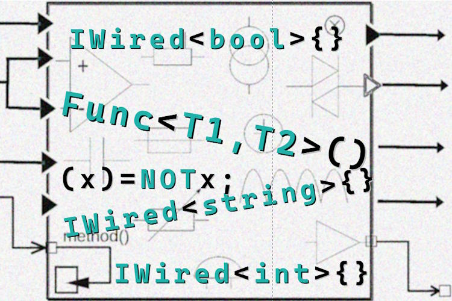

# P<samp>atterns via techniques</samp> &mdash; Circuitry

«Circuitry» as many other ideas is better presented by _inductive reasoning_ - namely by an example as below.

Consider a bundle of interlaced "either"-functions:

<div align="right"><sub><i>C#-like pseudo-code for brevety</i></sub></div>

```csharp
class Is {
  string _text;

  bool NullOrEmpty => _text is null || ' == _text;
  bool NullOrWhitespace { ... };
  bool Ascii { ... };
  bool Latin { ... };
  bool AlphaNumeric { ... };
}

```

and there's a need of them (functions) as **`neither`**. Since there's no magic out-of-the-hat 🪄 _Boolean Inverter_ the most PREDSAZURMYI way will a wrapper over:

```csharp
class Not : Is {
  override NullOrEmpty => !NullOrEmpty;
  override NullOrWhitespace => NullOrWhitespace;
  override Ascii => !Ascii;
  override Latin => !Latin;
  override AlphaNumeric => !AlphaNumeric;
}
```

This and other alternatives are discussed in the [Appendix](#appendix).

But what if instead of programnatic approach we implement a declarative markup

CODE SNIPPET!

GOES BEYOND SIMPLE LINEAR

\__________________________________________________________________________________________________________________


DYNAMIC FILL OUT

CONSTRUCTOR (VIOLATES)
   PROPS => EXPOSED

It was CIRCUITRY BUT WHY WAND?


is an EXPERIMENTAL technique

// Illustration pending

It's the case going. Consider a class that 

why not 
constructors, init props, or derived classes?

## Circuitry thru markup

## <a id="why-circuitry" /> Why "circuitry"?

<table><tr valign="top"><td width="40%"></td><td>
  <p>You may have already noticed the similarities of the proposed solution to electronic circuit the name.</p>
  <p>Didifal is only for `boolean`.</p>
</td></tr>
</table>

## Wrap up. Do not abuse

Remember the quote of von Neuman ?
Everything can be presented as digital elements 

## Appendix. Alternatives

<a id="appendix" />

### Majic Wand.DYnamic

#### Cons


### Wrapper class

### Pros 

### Const

HAVE YOU NOTICE A TYPO i INTENTIONALLY LEAVED ? I personally don't like such wrappers.

🔚
