<h1 align="center"><samp>Polymorphism➕</samp> &nbsp; &mdash; &nbsp; Properties “Shifting”, or T-R/W Modelling</h1>

<table><tr><td><picture></picture></td><td>

The best evolutionary paradigm of OOP is directly mapping real-life things or abstractions,  their structures, and collections onto code objects. 

Any object-oriented language will offer not only common paradigms but specific means and techniques to fine-tune or expand them. 
Next, we will bundle disparate **`C#`** techniques for _properties shifting_.

```mermaid

mindmap
    props)"`**PROPERTIES** 
SHIFTING`"(
      T["`**GENERIC**
parametrization`"]

      EQ("`**ASSIGN overload**
#0010;
implicit operators will do the job.*`")

      RW("`**READ-WRITE**
#0010;
combinations of
get|_init_|set`")

      DYN{{ ̶ ̶D̶Y̶N̶A̶M̶I̶C̶
cast override
#0010;
something unwelcome and to be replaced with other techniques}}

```

</td></tr></table>

* While your job is to define these operators

Fine-tuning at the language level traditionally concerns classes and methods, while properties conceal even more potential.

Let's address two independent issues:

READ/WRITE/INIT combinations

which we will put under the umbrella term _shifting_.

Maybe MORE LATER

🚧🚧🚧🚧🚧🚧🚧 ... under construction ... 🚧🚧🚧🚧🚧🚧🚧

Modeling generic properties with ragged access

And is quite good with this but simple (otherwise it couldn't be a winning paradigm).

It's our job to advance OOD further.

https://github.com/Kyriosity/read-write/tree/main/README%2B/software/design/samples#still-models

# Prop<code>&lt;T&gt;</code> R/W classes
 
## Read-Write-Init &mdash; "Jagged" - fluctuating properties

> 🚧... DRAFT ... 🚧

# C#&nbsp;&nbsp;&mdash;&nbsp;&nbsp;Ragged properties (T-RW-Modelling)

In a decent application, a class may represent a document structure.

The business logic may specify miscellaneous access.

## Ideas

INTERFACE ONLY

Most applications need to present the same entity (model) with a different exposure of items and read/write access. Consider developing a book register:

The set of items is quite usual and fixed: Title, ISBN, genre, years written, first-last published, original tongue(s) **(not xlation but some books are already polyglot ...), author(s), abstract, reviews.

* new (you can edit anything - ISBN)

> :exclamation: This is not REPLACEMENT of FIRM interfaces

## Realization

We can't escape making the number of interfaces, which equals the required combinations, but the technique matters.

+ allows easy auto-generation (e.g. with T4)

### Stubbing the interface

The easiest way is to have the "full open" class and cast it to the interface.

DYNAMIC !

\___________\
🌘 2023-2025 .. image credit: the poster fragment of "The Catman of Paris", 1946, dir. Lesley Selander
