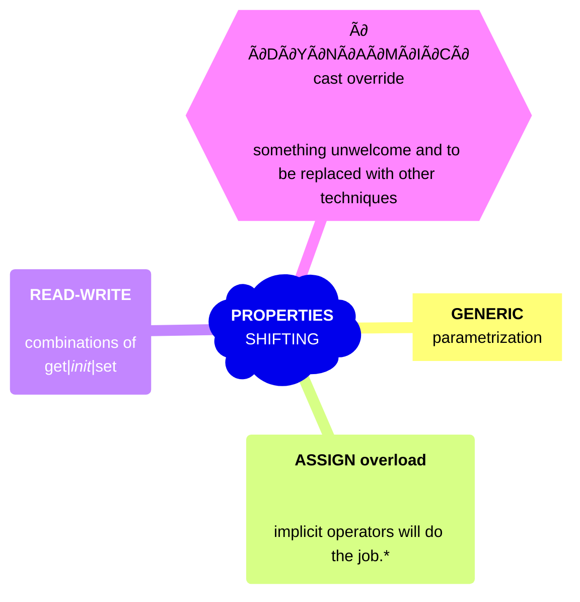

<h1 align="center"><samp>Polymorphism<sup>➕</sup></samp> &nbsp; &mdash; &nbsp; Properties “Shifting”, or T-R/W Modelling</h1>

<table><tr><td><picture></picture></td><td>

> **The best evolutionary paradigm of OOP is directly mapping real-life things or abstractions,  their structures, and collections onto code objects.**

Object-oriented languages offer common paradigms with specific means and techniques to fine-tune or expand them.

Such customization traditionally involves classes and methods, while properties conceal even more potential. Next, we will bundle disparate **`C#`** techniques for _properties shifting_.

</td></tr></table>



<p align="right">* <sub>While your job is to define these operators.</sub><br />
** <sub>More techniques can be added later.</sub></p>

Let's keep a _**book**_ as a convenient sample of our survey. It has a title, author(s), ID(s), publishing agent, year and tongue, and other traits. 
If some of them _shift_, as proposed below, then the inheritance approach will break on combinatory explosion.


## Generic properties (`<T>`-Properties)

Properties can't be generic like methods, but class generics can specify their _tuned_ type. This can be useful for selecting "fluctuating" model traits.

For example, there are two formats of ISBN or none; the author's birth can be known as an exact date, but for Homer, it's _circa_ 8th century BCE. 

Book authors may have dissimilar name patterns (even the Western can differ). 
An abstract can be some plain text or reference to an audio snippet.

```csharp

interface ISBN
{
   title : Digit[]
   publisher : Digit[]
   group : Digit[]
   check : Digit
}

partial class Book<TId> where TId : ISBN
{
   TId Id;
   ..............
}

interface ISBN_10 : ISBN { ... }
interface ISBN_13 : ISBN { ... }
interface ISBN_UK : ISBN { ... }
```

+ [**IBook**](https://github.com/Kyriosity/use-dev/blob/main/src/TuttiFrutti/AbcModels/Library/IBook.cs) written in  [AbcModels](https://github.com/Kyriosity/use-dev/blob/main/src/TuttiFrutti/AbcModels/) shows parametrization with casting parameters.
+ This technique was also utilized in more practical and mature [AbcChrono](../../../../parts/AbcChrono).

## Read-write ragged properties (R/W-Properties)

Classes as `Book` represent entities greater than objects &mdash; _documents_. Consider a book register.

Application logic will require differing access exposure of items: between full-edit and read-only. 
And they all may not rest on the single inheritance axis as these:

* new: all fields are open to edit (`get` / `init`)
* edit statuses, digest, last printed and reviews: (`get` / `set`)
* listing: all fields are for viewing (`get` only)

Sample implementation can or shall be based on the previous `<T>`-technique as in [Annotated R/W](https://github.com/Kyriosity/use-dev/blob/main/src/TuttiFrutti/AbcModels/Bits/Reviewed/IAnnotated.cs)

## Implicit overload of the <samp>assignment</samp> operator

If previous techniques deal with compatible (casted/inherited) interfaces, the overloaded `=` allows to cast non-castable. 
Technically not, but logically compatible models will require this technique. As well, it can be particularly useful for _foreign_ entities, which you can't "cross-interface".

## Wrap-up

These techniques allow the creation of fluctuating but compatible models. It's not for security/access limitations but to make the models flexible and prevent accidental changes of non-relevant parts.

## Appendix. Realization ideas

The easiest way is to have the "full open" class or few and render them through the set of interfaces. Or dynamic code generation &mdash; now much more facilitated by Roslyn.

We can't escape making the number of interfaces, which equals the required combinations, but the technique matters. In too explosive scenarios, they could be auto-generated (e.g., T4 templates).

\___________\
🌘 2023-2025 &nbsp; ... &nbsp; (image credit for shape shifter: the poster fragment of "The Catman of Paris", 1946, dir. Lesley Selander)
