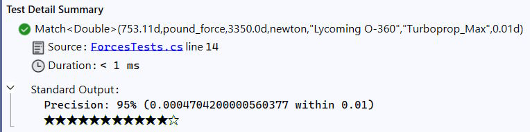
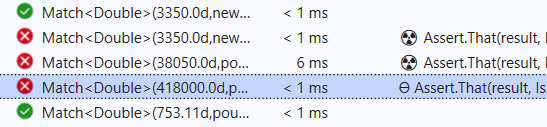

# Software Tests &nbsp;&mdash;&nbsp; _Loose Assert_ &nbsp;&mdash;&nbsp; Graduality

<table><tr valign="top"><td width="40%"><picture></picture>
 </td><td>
<h4>Despite our preferences for programming languages and frameworks, we are used to categorical feedback from tests:</h4>

either 🟢<b>success</b> or 🔴<b>fail</b>.

The majority of proofs don't ask for more, and many developers may never need anything else, but there are cases with fuzzy and changeable criteria:

<lu>
 <li>precision of calculations/deviations,</li>
<li>success probability (of response, reservation, or a win),</li>
<li>performance (execution time and other resource consumption),</li>
<li>strength of algorithms (encryption).</li>
</lu>
   

Another aspect is a negative result. The failure on a specific return value can indicate:

<ul>
<li>small <b>vs</b>. huge deviation from the expected interval,</li>
<li>fully unexpected result,</li>
<li>sudden exception,</li>
<li>timeout,</li>
<li>irrelevant error (e.g. canceled, connection error, resource fail, <i>etc.</i>).</li>
 </ul>

Here empty methods and tests for expected exceptions look to be the only unequivocal.

</td></tr></table>

## Issue/Solutions

To my knowledge, neither widespread test framework supports shades of 🟢green and 🔴red. This could be a star rating (★★★☆☆), a `1`-`10` scale, or a percent. 

## Workarounds

There are no magic solutions to adjust the frameworks. The following options can make it fast but not elegant:

+ programmatically setting auxiliary test statuses: e.g. [`Inconclusive`](https://learn.microsoft.com/en-us/dotnet/api/nunit.framework.assert.inconclusive?view=xamarin-ios-sdk-12)🪟 to indicated not exact but passing result, 
+ printing relative results with available symbols

### <samp>C#.NET</samp>

<picture></picture> [conversion tests ](../../../src/TuttiFrutti/FuncStore.Convers.Tests/) use % and symbolic output to evaluate accuracy:

<picture></picture>

and symbolic ranking of failure:\
<picture></picture>

## Further

Gradual assert interlaces with [evaluation tolerance](val_tests-tolerance.md).

\___________\
🔚 ... 2024-2025 Image credit: screenshot of Visual Studio; screenshot of HBO mini-series, 2019
