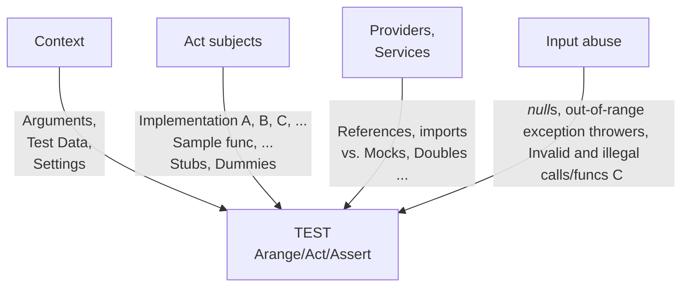

# Test automation &mdash; Tests with multi-feed

Either [TDD](https://github.com/Kyriosity/read-write/tree/main/README%2B/software/tests/asDrive)<sup>⬅️</sup> or proof of the provided code, 
a conventional fashion is to pick a software entity (class, function, or something else) and write a particular test case over it, then consider and write other cases.

Developing tests this way must wrap software features in nice <b>D</b><i>escriptive</i> <b>A</b><i>nd</i> <b>M</b><i>eaninigful</i> <b>P</b><i>hrases</i> (aka <mark><b>DAMP</b></mark>). 
However, this approach will combinatorially explode:


<details><summary><ins>&nbsp;Legend;&nbsp;</ins></summary>
    &nbsp;

#### Context

#### Abuse

\___________
</details>

## DRY it

Bloating tests mass will deteriorate: negligence, scrappy coverage, impeded navigation, and badly exorbitant maintenance. Unless we apply **D**_on't_ **R**_epeat_ **Y**_ourself_ (aka <mark><b>DRY</b></mark>) to our tests ...

Most frameworks will support one-dimensional scaling.


AUTO-COMBINATION

## Workarounding

The best thing ould be if 


LINK TO ASSERT-ACT breakup

### Parametrization

```csharp
[Test, SOURCE(A, B2, C30, D04, ...)]
MeaninglessMethodName()
{
    var result = FACTORY.FuncOfTest(Arrange());
    ASSERT(result); // fail or success
}
```

#### SPOILERS

### Functions

### 


Unless we ...


routine for a particular run. Let's illustrate with a primitive:\
`Asserts: Root.Square(4) == 2`

The next step is to supply various data and expectations - something that a ripe framework will provide out of the box:\
`DataRows[]`\
or you may 


// Many frameworks support keywords for the data combinations

MULTI-FUNC and VARIOUS TYPES

Just take an entity (unit) of an application as a `class` or `function` and cover it with proofs.


An [example test](../../../src/TuttiFrutti/FuncStore.Convers.Tests/PhysMath/Dims/LengthsTests.cs) with two feeds

Stubdd

Let's put 3D glasses on 
3D exploded view

+ win-win: data <-> test
* ?? false true (by coincidental match)
* ?? accumulated warnings/errors/info (e.g. unparsed)

## Wrap up

Was it all about unit tests? Yes, but can work for others in the pyramid.

Related topics\
|- Elusive unit of test

🔚
