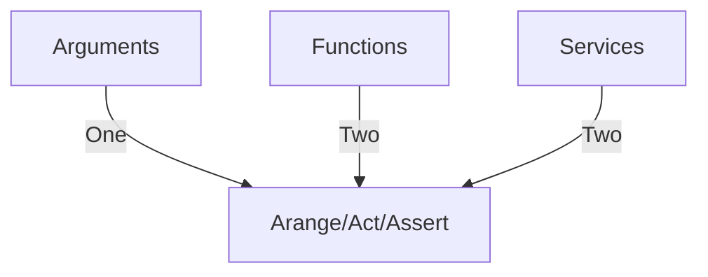

# Test automation &mdash; Unit tests with multi-feed

Either it's [TDD](https://github.com/Kyriosity/read-write/tree/main/README%2B/software/tests/asDrive)<sup>⬅️</sup> or proof of the existing code, the conventional approach to tests is to take a piece of functionality and write a proof routine for a particular run.

`Asserts: Root.Square(4) == 2`

Just take an entity (unit) of an application as a `class` or `function` and cover it with proofs.



This approach is OVER and clutches testing projects with space with UNPACKED.

```csharp
[Test, SOURCE(A, B2, C30, D04, ...)]
MeaninglessMethodName()
{
    var result = FACTORY.FuncOfTest(Arrange());
    ASSERT(result); // fail or success
}
```

An [example test](../../../src/TuttiFrutti/FuncStore.Convers.Tests/PhysMath/Dims/LengthsTests.cs) with two feeds

Stubdd

Let's put 3D glasses on 
3D exploded view

+ win-win: data <-> test
* ?? false true (by coincidental match)
* ?? accumulated warnings/errors/info (e.g. unparsed)

Related topics\
|- Elusive unit of test
