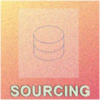
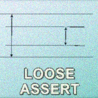
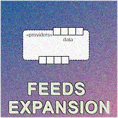
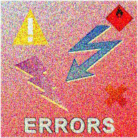

# Test frameworks &nbsp;&mdash;&nbsp; Patch If Can't Reframe

<h1 align="center">Patchwork on Framework</h1>

<table align="center"><tr align="center" valign="bottom">
<!--                                                                                                     S O U R C I N G    --!>
<td>
   
</td>
<!--                                                                                                 L O O S E   A S S E R T    --!>
<td>
  
</td>
<!--                                                                                                     S Y N T A X    --!>
<td>
  
</td>
</tr><tr></tr><tr align="center">
<!--                                                                                                     FEED CUTS    --!>
<td>
  
</td>
<!--                                                                                                     E R R O R S    --!>
<td>
    
</td>
<td></td></tr>
<tr><td></td><td></td>
<td>
  
</td>
</tr>
</table>

<table align="center"><tr></tr><tr><td>
  
</td><td>

This section branches from conceptual discussions of [Tests](https://github.com/Kyriosity/read-write/tree/main/README+/software/tests), and [Quality Assurance](https://github.com/Kyriosity/read-write/tree/main/README+/software/QA) and proposes realistic decisions for programmatic tests and their automation.
  
</td></tr></table>

## NUnit boosting

NUnit is a conventional, reliable, and universal test framework, but like most FOSS, it has limited resources, and its contributors aren't obliged to any delivery.

There are apparent items to estimate:

+ bulky and restrained syntax (and it's not [DAMP](https://github.com/Kyriosity/read-write/blob/main/README+/software/tests/asQA/README+/tests-damp_vs_dry.md)),
+ pending bugs,
+ missing calls and features.

<h4 align="center">Without further ado, <a href="../../src/TuttiFrutti/FeatTest/">Feat. Test</a>🧪 demonstrates what's already available.</h4>

## Challenges, posers, and their solutions

⏭️ 📂[README+](README+)

## Wrap up. A word on definitions

_Unit Tests_ are only a slice of the test pyramid, but technically they may serve all other types and layers (I can't remember <kbd>New -> Integration test</kbd> in IDEs).

\___________\
🔚 ... 2023-2025
