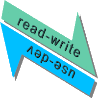

> ### Enough reasons speak for a new testing doctrine and deep rework of test frameworks. This is an enormous and great [<samp>CHALLENGE</samp>](https://github.com/Kyriosity/read-write/tree/main/README%2B/software/tests/README%2B/theory), and to put it off, let's first mend what's reasonable.

<table><tr valign="top"><td>
<h3 align="center"><picture></picture></h1>

<table align="center"><tr align="center" valign="bottom">
<td><!--                                                                                                     S O U R C I N G    --!>
   
</td>
<td><!--                                                                                                     F E E D   C U T S    --!>
  
</td>
<td><!--                                                                                                      S Y N T A X    --!>
  
</td>
</tr><tr></tr><tr align="center">
<td><!--                                                                                                 L O O S E   A S S E R T    --!>
  
</td>
<td><!--                                                                                                     E R R O R S    --!>
    
</td>
<td><!--                                                                                                 R E A D / W R I T E    --!>
  
</td></tr></table></td><td>

<samp><i><b>PATCH if CAN'T REFRAME or REWORK</b></i></samp>

## &nbsp;

> [!NOTE]
> * "Patches" are very embossed by `C#` and [NUnit](https://nunit.org/), but challenges and solutions must be common for other languages and frameworks.
> 
> * _Unit Tests_ are only a slice of the test pyramid, but technically they may serve all other types and layers.🙋

🙋 <samp>Have you ever seen IDEs with <kbd>New &rarr; Integration test</kbd>?</samp>

</td></tr></table>

\___________\
🔚 ... 2023-2025 ...
