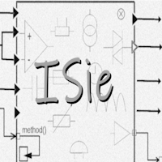
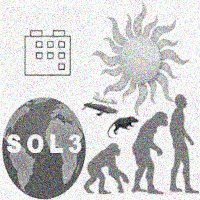
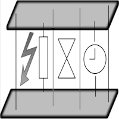
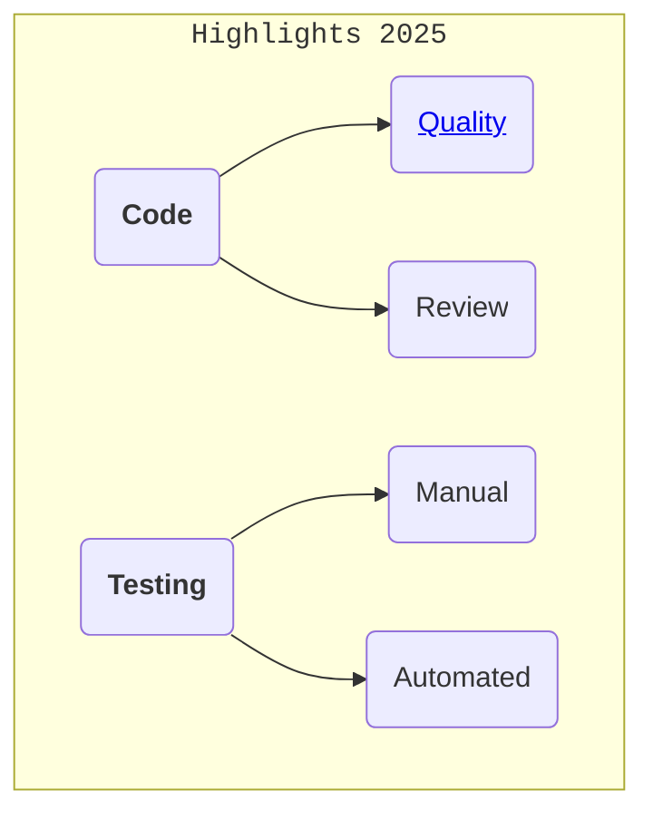

<a id="highlights" />_____&nbsp;<samp><b>H&thinsp;I&thinsp;G&thinsp;H&thinsp;L&thinsp;I&thinsp;G&thinsp;H&thinsp;T&thinsp;S</b></samp>&nbsp;____

  &nbsp;
  <table><tr>
    <td>
      
       
<h4><a href="README+/parts/_ext/README+/ISie.md">EXTENSIONS</a></h4>

     </td><td>
      
       
<h4><a href="README+/parts/AbcChrono/README.md">CHRONO ABC</a></h4>

    </td><td>
      
       
<h4>✒️&thinsp;<a href="README+/parts/MultifacetVal/README.md">MULTIFACET VALUE</a>&thinsp;🐝</h4>

    </td>
                                                      </tr><tr></tr><tr>
    <td>
      
       
<h4>🚧&thinsp;<a href="README+/parts/Rvrs/README.md">REVERSIBLE</a>&thinsp;🚧</h4>

    </td><td>
      
         
<h4>🐝&thinsp;<a href="/README+/decisions/README+/think_in_tasks/README.md">THINKING in TASKS</a>&thinsp;⏰</h4>

    </td>
    <td>
      
         
<h4>⬅️&thinsp;<a href="https://github.com/Kyriosity/read-write/blob/main/README+/pencraft/README+/essays/README.md">E&thinsp;S&thinsp;S&thinsp;A&thinsp;Y&thinsp;S</a></h4>

    </td>
  </tr></table>
  
_________________________________________________________________________________________________________________________

<table><tr><td width="28%">
<!--      O R G    --!>
◾ <b>O&thinsp;R&thinsp;G</b> 
|- <b>Frames, guidelines</b>&nbsp;📖&thinsp;<a href="README+/frames"><i>Intro</i></a> 
|-- <a href="README+/frames/README+/reinforced_inheretance.md">Reinforced inheritance</a> 
|-- <a href="README+/frames/README+/calls_on_null.md">Calls on null</a> 
|- <b>Patterns</b> 
|-- <a href="/README+/techniques/README+/circuitry/README.md">Circuitry</a> 
|-- <a href="/README+/techniques/README+/builders/README.md">Builders</a> 
|-- M&thinsp;V&thinsp;V&thinsp;M 
|--- <a href="README+/decisions/README+/mvvm/mvvm-notification_orchestration.md">Notificaton orchestration</a> 
|--- <a href="README+/decisions/README+/mvvm/mvvm-vmodel_cohesion.md">Model-ViewModel cohesion</a> 
|- <b>Templates</b> 
|-- <a href="README+/decisions/README+/thins_in_tasks/README.md">Tasks as models</a> 
 <!--      C L A Y    --!>
◾ <b>C&thinsp;L&thinsp;A&thinsp;Y</b> 
|- Exception wrappers &nbsp;<a href="src/TuttiFrutti/ExtensionsTests/Exceptions"><i>tests</i></a>🧪 
|- Extensions/shortcuts 
|- 🚧Models 
|- Motley heap <a href="src/TuttiFrutti/AbcStructTests/Heaps"><i>tests</i></a>🧪 
|- <b>WPF</b> 
|-- <a href="README+/snippets/wpf/bool2viz_improved.md">Bool-Vis. converter</a>improved 
 <!--               T E S T I N G -->
◾ <b>T<samp>ESTING</samp></b>&nbsp;📖&thinsp;<a href="README+/tests"><i>Intro</i></a> 
|--- <a href="README+/tests/README+/prog_tests-cut_feeds.md">Cutting the feed expansion</a> 
|--- <a href="README+/tests/README+/unit_test-gradual_assert.md">Gradual assert</a> 
|--- <a href="README+/tests/README+/val_tests-tolerance.md">Finer tolerance</a> 
 <!--           PARTS -->
◾ <b>P&thinsp;A&thinsp;R&thinsp;T&thinsp;S</b>&thinsp;📦 
|- <a href="arts/_ext/README+/ISie.md"><b>I&thinsp;S&thinsp;i&thinsp;e</b></a> extensions 
|- <a href="README+/parts/AbcChrono">Chrono ABC</a> 
|- <b>Funcware</b> 
|-- Conversion&nbsp;<a href="src/TuttiFrutti/ExtensionsTests/Exceptions"><i>tests</i></a>🧪 
|- 🐝<a name="UVal" href="README+/parts/MultifacetVal"><b>Multifacet value</b></a> (Π-Val) 
|- 🚧<a href="README+/parts/Rvrs">Undo/Redo</a> (Reversible) 
</td><td width="5000px"> 
  

</td></tr></table>

\___________\
<samp>INSTALLATION</samp>: Clone, copy, download `src`, and open the solution in Microsoft Visual Studio
