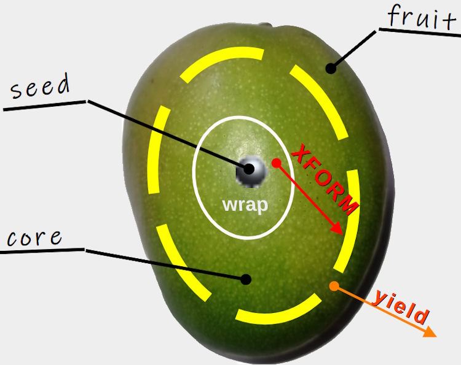

# <samp>Code construction</samp> &nbsp; &mdash; &nbsp; Wizard blocks

> **This project partially answers the [builder challenge](../../../README+/techniques/README+/builders/README.md).**

> [!IMPORTANT]
>  #### This writing is now <samp>DRAFT</samp> **but not** <samp>DEBRIS</samp> &thinsp;&mdash;&thinsp; its project is experimental but working (already tested and applied).
> Nevertheless, this project must be a trial and a collector of ideas for the real production version.\
> First, its **title** asks for refiтement. Other pending ideas are marked below with 💡.\
> &nbsp;

## Scheme

+ Builder
+ Parameters accumulator
+ Fuser

<picture></picture>

### Horticultural glossary

<table><tr valign="top"><td width="40%"><picture align="center"></picture>
</td><td>

+ **Seed** &mdash; initial value of any type:\
Consider it like _zero_ on a calculator or raw literal, kick-off meeting, etc.
+ **Core** &mdash; basic wrapper of _seed_ without linking, 
"may contain" _seed_ transformation functionality (e.g., `string` -> `bool`)\
Starts a chain of _Pulps_&thinsp;/&thinsp;_Fruits_
+ **Pulp** &mdash; functional wrapper over the core\
must/shall yield the result, even if it's not supposed to be returned there\
may contain predefined linking to the previous or next block (in wizards these can be boolean `and`, `or`, or xor),
+ **Fruit** &mdash; yield result.
+ **Ripe** &mdash; ready universal blocks, which can be put in the wizard chain (in fact, a non-abstract class)
  
</td></tr>
</table>

## Peculiarities

+ Parametrized: by type and connecting functions
+ No manager, aggregator, or monolith -> blocks are stand-alone.

Loose coupling - min data xfer:\
💡 `// ToDesign:` blocks of different seed types

## Application

* [⭐**ISie**⭐](../../../README+/parts/_ext/ISie/README.md)
* Yours coming

## Bottom line

🚧 TO BE WRITTEN

\___________\
🔚 🌙2025
